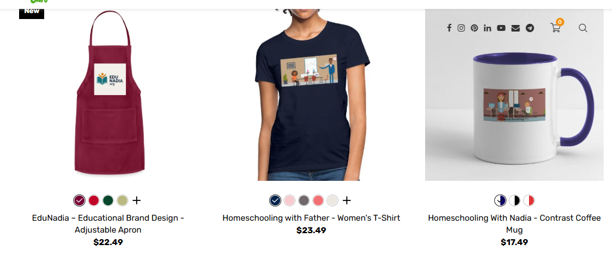
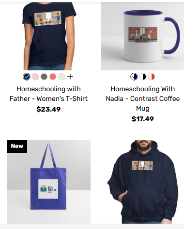

# 🛍️ WordPress Print-on-Demand (POD) Shop Integration

## Project Overview
This project features the creation and integration of a specialized Print-on-Demand (POD) shop for the **EduNadia** brand. The goal was to build a seamless e-commerce experience where educational branding meets merchandise.

## 📱 Responsive Design (Desktop vs Mobile)
A key focus of this project was ensuring that product displays look perfect on all devices.

### Desktop View
High-resolution display of products including the "EduNadia" Apron, T-shirt, and Coffee Mug.

### Mobile Optimization
A fully responsive grid layout that ensures a smooth shopping experience for mobile users.

## 🛠️ Skills & Tools
* **E-commerce Integration:** Setting up product catalogs and store layouts.
* **Responsive Design:** Customizing CSS to ensure a 100% mobile-friendly interface.
* **Branding:** Consistent application of the "EduNadia" visual identity across diverse products.

## ✅ Conclusion
This project demonstrates my ability to bridge the gap between branding and functional e-commerce, delivering a professional store ready for global customers.

---
*By Nadia Al-Hassan*
